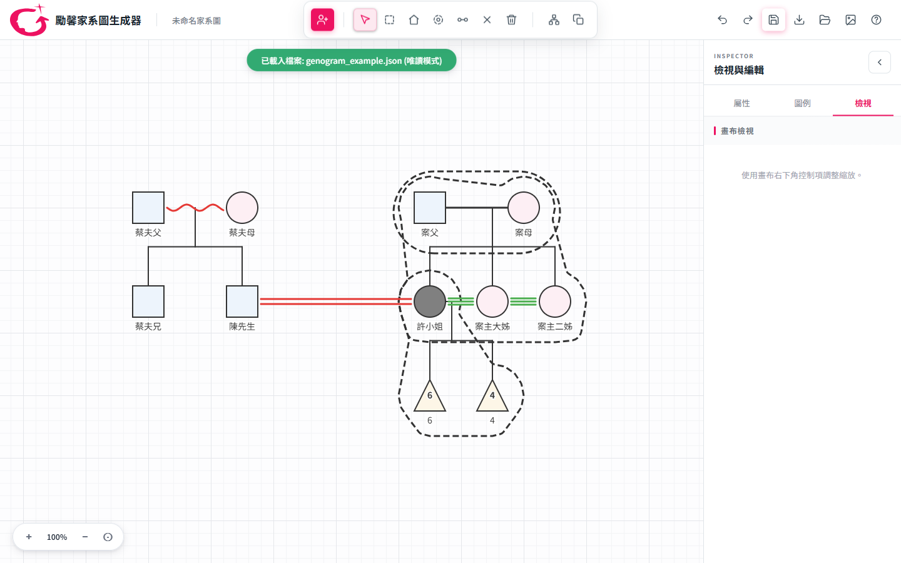
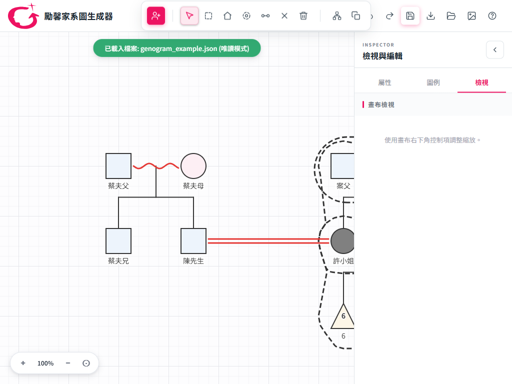
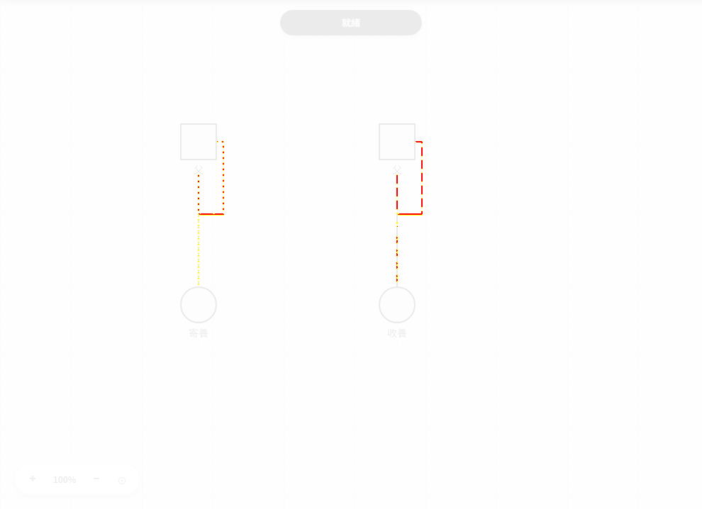
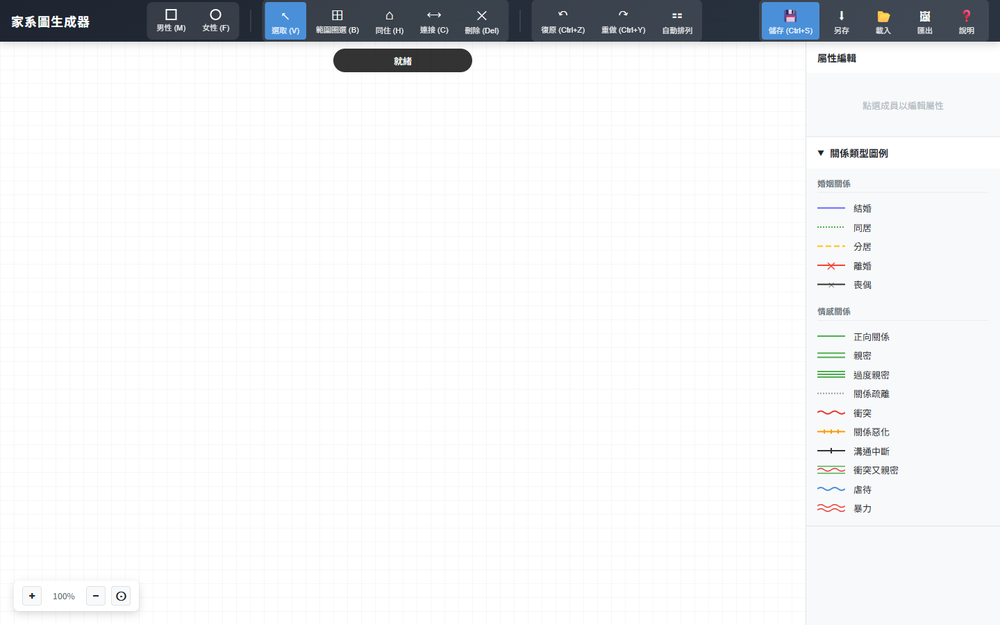
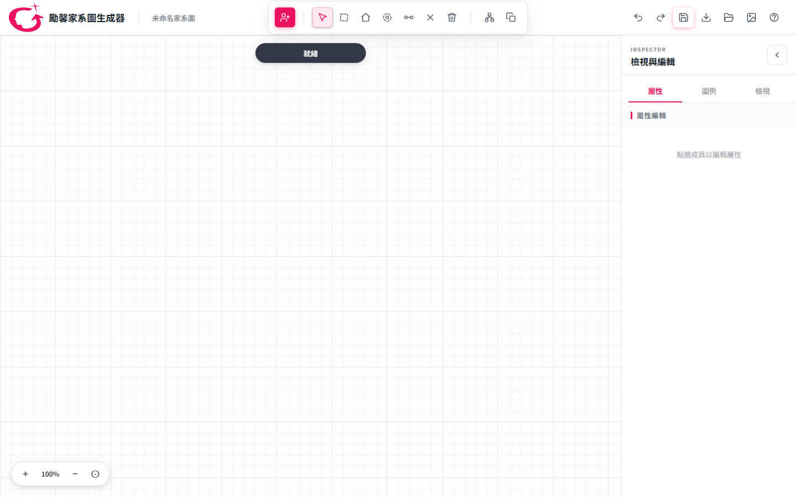
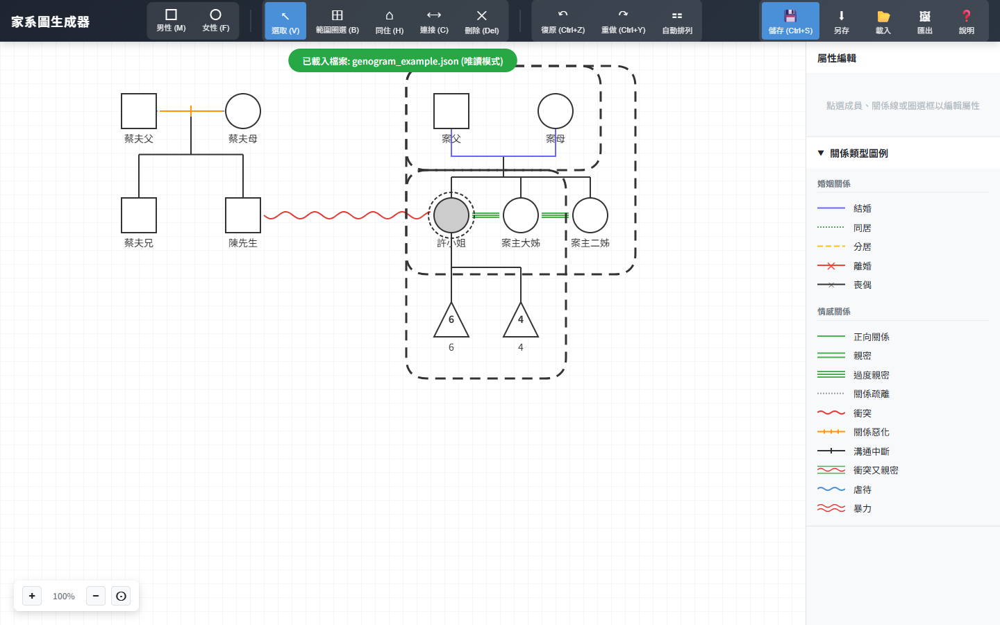
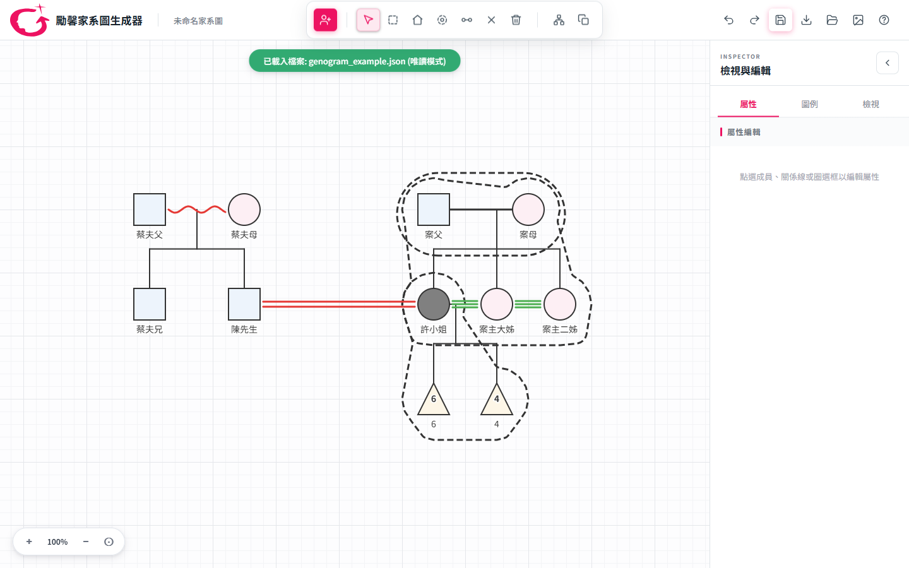

# 家系圖專案健檢與初版差異報告

日期：2026-07-15 
目前分支：`codex/view-controls-release-hardening` 
功能與基準驗證版本：`db38d7b`（不含本報告證據提交） 
初版比較基準：`11810d8`（2025-12-18，Git 歷史中第一個可重現版本）

## 1. 結論摘要

目前分支已完成本次稽核列出的發布前工作與高感知 UX 微調，可作為下一版 release candidate。核心資料、親屬方向、智慧放置、Undo/Redo、同住框、生活圈、視覺匯出、關係線命中與效能均未發現重大回歸；21 支 `verify_*.js`、視覺 smoke、Golden 16/16、三副本 raw MD5 與 `geno` 零外部請求全部通過。

本報告第 2–7 節保留修正前的稽核證據與初版比較，方便追溯決策；第 8 節記錄實作後的結案狀態與新鮮驗證數字。這次仍沒有發現 P0 等級的資料損壞、安全事故或核心功能故障。

## 2. 檢查方式與範圍

- 以初版 commit `11810d8` 與目前 commit `2e6a5fb` 做 Git、原始碼與畫面比較。
- 在 1440×900、1024×768、900×768 三種 viewport 實際操作。
- 用同一份初版 `genogram_example.json`（11 人、17 關係、3 同住框）載入兩版比較。
- 另用 26 人、41 關係的既有資料檢查大圖載入與可見範圍。
- 實際走過「新增角色 → 選擇性別 → 格位預覽 → 點擊建立 → Undo」。
- 執行 15 支 `verify_*.js`、16 張 golden-image 與 20／100／200 人效能基準。
- 檢查 root、`geno/`、`refactor/app/` 的內容、MD5、離線部署與外部資源。

## 3. 修正前需要處理的項目

優先級定義：P1＝下次發布前；P2＝下一輪微調；P3＝可順手整理或觀察。

| 優先級 | 問題／觀察 | 證據與影響 | 建議 |
|---|---|---|---|
| P1 | Golden gate 目前為 9/16 通過 | 失敗的 7 張全是家庭／親子走線：03、08、10、12、13、15、16。符號、婚姻、情感、虐待等 9 張為 0 差異。差異來源是 golden 基準建立後才加入的安全家庭走線，與 `TEST_GATES.md` 記錄一致；不是線色或符號語意回歸，但目前 CI／人工 gate 仍會失敗。 | 逐張確認這 7 張 current；只更新核准圖片，禁止整批覆寫。更新後再跑 16/16。 |
| P1 | 三副本 raw MD5 不一致 | 9 個 JS 中只有 `family-route-planner.js` raw MD5 不同；CSS 與 root/refactor index 亦不同。正規化 CRLF/LF 後，root、`geno/`、`refactor/app/` 的 JS/CSS 內容完全一致，root 與 refactor index 也一致，所以是換行格式問題，不是版本內容落後。仍違反專案「MD5 必須一致」的發布規則。 | 同步時統一 EOL，再重算 MD5。不可直接用 root index 覆蓋 `geno/index.html`，因 `geno` 必須保留本地字型與 vendor 路徑。 |
| P1 | 正式 root 與離線 `geno` 的定位容易混淆 | root 會連線到 Google Fonts、cdnjs 的 jsPDF、unpkg 的 dagre；`geno` 則已驗證零外部請求。初版原有 Service Worker/PWA，現在 root 已移除離線快取。資料本身沒有被上傳，但 root 仍有外部依賴與供應鏈／斷網風險。 | 明確定義：公開版要採 root CDN 還是 `geno` 全本地版。若隱私與斷網優先，建議正式部署採本地 vendor；至少在 README 清楚區分。 |
| P2 | 「檢視」分頁尚未完成 | 畫面只有「使用畫布右下角控制項調整縮放」。設計稿預定的姓名、年齡、備註、醫學標記、情感線、同住框、生活圈顯示切換，以及焦點模式／語意縮放都不存在。 | 若大型複雜個案是主要情境，先做顯示層與焦點模式；語意縮放、導覽圖可後做。若短期不做，分頁名稱可改成「縮放」或先隱藏，避免像未完成頁。 |
| P2 | 大圖載入後沒有「全圖顯示」 | 26 人資料的 X 範圍約 2400px；載入後固定 100% 並只置中，1440×900 下有 18 人在當前 canvas 外。這不是資料遺失，使用者仍可平移／縮小，但第一眼容易誤以為少人。 | 保留現有「重置 100%」，另加「符合全圖／Fit to view」；載入大型檔後可提示使用者或自動執行一次。 |
| P2 | 一般新增角色的狀態文案錯誤 | 點工具列「新增角色」時，頂部提示為「選擇 父母 的性別」，原因是一般新增沿用 `showGenderModal('parent')` 的輩分標籤。實際建立流程與資料都正確。 | 一般新增改為「選擇新增人物的性別」；快速新增父母才顯示父母文案。 |
| P2 | 狀態提示會長時間遮住畫布上緣 | 「就緒」、「已載入檔案」、「已建立人物」等訊息沒有通用自動消失機制，會一直停在 canvas 上方中央。上排人物靠近頂部時可能被遮住。 | 成功／資訊訊息 2–4 秒後淡出；只有連接、放置、生活圈等進行中的操作提示保持常駐。 |
| P3 | 單親親子線為避開姓名產生小側繞 | 新安全路徑會從人物側邊繞過姓名再回到子女 X，邏輯與命中測試正確，但簡單單親直線看起來比初版更曲折。 | 將「單親、同 X、走廊無障礙」設為簡化特例，或保留現況並請實務使用者決定偏好。 |
| P3 | 每次載入會請求不存在的 `/favicon.ico` | 兩版都會產生 404；不影響功能，但 console 不乾淨。 | 在 `<head>` 指向現有 `icon-512.png`，或補一個 favicon。 |
| 觀察 | 首次完整建路徑成本提高 | 200 人首次最慢 235ms，之後暖重繪 1.29ms、60.5 FPS。安全走線把成本移到首次建 cache，互動期反而約快一倍。 | 暫不需優化；持續把「首次建圖」與「暖互動」分開監測。 |

### 檢視分頁與 1024px 現況

| 「檢視」目前為占位內容 | 1024px 時 Inspector 維持展開 |
|---|---|
|  |  |

1024px 畫面沒有文件 overflow，但 Inspector 會留下約 708px 畫布寬度；使用者仍可手動收合，低於 980px 才會自動收合。

### Golden 中最值得再看的一張

以下差異圖顯示單親線為避開姓名而出現側繞；紅／黃為新舊路徑差異：

## 4. 初版與目前版本的實際差異

### 4.1 空白工作區

| 初版（2025-12-18） | 目前版本（2026-07-15） |
|---|---|
|  |  |

目前版的提升：

- 從深色、長條、emoji/文字工具列改成勵馨品牌的臨床工作區；圖示統一為 SVG。
- 全域檔案操作、畫布工具與右側 Inspector 有明確層級。
- 右側面板可收合、分成屬性／圖例／檢視，並具備 tab ARIA 與鍵盤操作。
- 畫布使用單一網格來源，工具按鈕、焦點、提示與性別淡色更一致。
- 1024px 無文件名稱碰撞、無頁面 overflow；低於 980px 會自動收起 Inspector。

### 4.2 同一份資料的繪圖差異

| 初版 | 目前版本 |
|---|---|
|  |  |

同一份 11 人／17 關係／3 同住框資料在兩版都完整載入。主要差異如下：

| 面向 | 初版 | 目前版本 |
|---|---|---|
| 人物視覺 | 多為白底符號，案主標示較弱 | 男／女淡色底、案主灰底、名稱 halo，辨識更快 |
| 同住框 | 固定圓角矩形，容易包入大量空白 | 依成員形狀建立平滑凹包／膠囊，支援巢狀與邊界命中 |
| 生活圈 | 無 | 可畫、拖曳、編輯、Undo，並納入所有匯出 |
| 家庭線 | 基本直線／樹狀線 | 共享安全路徑、避開符號與標籤、draw/hit/export 共用幾何 |
| 多婚線 | 基本天橋 | 自動 ㄇ／一／ㄩ、手動覆寫、按鈕 z-index 優先、日期跟線 |
| 子女語意 | 單一親子線 | 親生／收養／寄養、雙胞胎同卵／異卵、流產／人工流產 |
| 關係線 | 約 24 種 | 38 種，新增法律同居／分居、愛／熱戀、更多敵對與虐待細分 |
| 關係資料 | 類型與簡單 notes | 日期、說明、方向對調、routeMode、linkType、舊檔正規化 |
| 新增人物 | 男／女按鈕後直接加入 | 性別／多元性別對話框、半透明格位預覽、占用提示、Esc、單筆 Undo |
| 快速親屬 | 有限 | 父母、手足、伴侶、兒子、女兒、懷孕；自動建立正確方向的關係 |
| 儲存／匯出 | JSON 與 PNG 為主 | PNG、JPEG、SVG、PDF、JSON、複製圖片，含圖例／備註／解析度選項 |
| 離線策略 | PWA Service Worker | root 移除 PWA；`geno` 提供全本地、零外部請求版本 |

### 4.3 架構、測試與效能差異

| 指標 | 初版 | 目前版本 |
|---|---:|---:|
| 可重現提交後累積變更 | 基準 | 143 commits |
| 核心 HTML/CSS/JS | 8 檔、約 6,572 行 | 11 檔、約 16,163 行 |
| 人物查找 | 多處 `persons.find` | `personMap.get`，200 人 benchmark find count 0 |
| 親屬推論 | 分散在 App／座標規則 | `KinshipEngine` 單一來源，固定 parent→child |
| 家庭走線 | Canvas 內部即時計算 | `FamilyRoutePlanner` 純函數、cache、局部障礙集合 |
| 視覺回歸 | 無完整 gate | 16 張 golden fixtures |
| 自動回歸 | 少量單檔測試 | 15 支 `verify_*.js` + smoke + golden + benchmark |
| 200 人暖重繪 | 2026-04 基準 2.58ms | 1.29ms |
| 200 人平移／縮放 | 60.5／60.5 FPS | 60.5／60.5 FPS |

## 5. 測試結果（修正前稽核基線）

### 通過

- 15/15 支 `verify_*.js` 全數通過。
- 智慧放置 79/79、拖曳 19/19、婚姻幾何 19/19、關係線邊界 15/15。
- 家庭路徑規劃器 13/13、整合 12/12。
- 同住框／生活圈、親子線類型、雙胞胎、round-trip、Canvas 字型、UI shell、離線 `geno` 部署全部通過。
- 相同資料兩版皆載入為 11 人／17 關係／3 同住框，無 page error。
- 唯一 console error 是 `/favicon.ico` 404。

### 尚未通過

- Golden：9/16 完全相同；7/16 因家庭安全走線改變而失敗。
- 此狀態符合最近設計與測試記錄中的核准差異範圍，但尚未形成新的正式 baseline，因此發布 gate 仍應視為未完成。

### 2026-07-15 benchmark

| 情境 | 人數／關係 | 暖重繪平均 | 暖 P95 | 平移 | 縮放 |
|---|---:|---:|---:|---:|---:|
| small | 20／24 | 0.16ms | 0.32ms | 60.5 FPS | 60.5 FPS |
| medium | 100／184 | 0.63ms | 0.93ms | 60.5 FPS | 60.5 FPS |
| large | 200／384 | 1.29ms | 1.93ms | 60.5 FPS | 60.5 FPS |

## 6. 原始建議執行順序（已於第 8 節結案）

### 下一次發布前

1. 人工核准並只更新 7 張家庭／親子 golden。
2. 統一三副本 EOL，重跑 raw MD5；保留 `geno/index.html` 的本地資源差異。
3. 決定正式部署採 root CDN 或 `geno` 全本地版，更新 README 與發布 SOP。
4. 重跑 15 支 verify、16/16 golden、`verify_geno_deploy.js`、benchmark smoke。

### 下一輪小改

1. 修正「選擇父母的性別」文案。
2. 加入「符合全圖」控制，不取代現有 100% reset。
3. 讓一般成功／資訊 status 自動淡出。
4. 補 favicon。

### 下一階段產品改善

1. 先完成「檢視」分頁的顯示層與焦點模式。
2. 再評估語意縮放、標籤避碰、局部對齊與小型導覽圖。
3. 請實務使用者決定單親安全線的側繞是否要簡化，避免只用工程觀點拍板。

## 7. 最終判斷

與最初版本相比，現在的家系圖已從「能畫圖的單頁工具」進化成「具有臨床語意、可控走線、可靠資料往返、專業介面與完整回歸護欄的工作區」。本次已收乾淨發布基準、三副本一致性、root／geno 部署策略、檢視控制、Fit、狀態生命週期與 favicon。

若只問「現在能不能使用」：可以，而且核心品質良好。 
若問「能不能作為下一版 release candidate」：可以；完整證據與仍保留的產品邊界見第 8 節。

## 8. 2026-07-15 修正完成紀錄

### 8.1 已解決項目

| 項目 | 完成內容 | 主要提交 |
|---|---|---|
| View 顯示控制 | 新增姓名、年齡、備註、醫學標記、一般情感線、同住框、生活圈七個 session-only 開關；隱藏項目不命中、不寫入 JSON/history | `ebb7c23`、`ec0f3ff` |
| 視覺匯出一致性 | PNG、JPEG、SVG、PDF、複製圖片遵循目前 View；JSON 完整保留；匯出不再暫時改寫 `Person.notes` | `018ff19` |
| 符合全圖 | 新增手動 Fit；大型 JSON 自動 Fit、小圖維持 100%、極大圖最低 25%；LocalStorage 恢復保留視角 | `c63ec7b` |
| Fit 競態 | 明確 render 會取消尚未執行的 stale auto-fit，避免載入後拖曳／像素取樣被延遲視角覆寫 | `6461e1a` |
| 新增人物文案 | 一般新增改為「選擇新增人物的性別」，既有父母格位語意與快速親屬文案不變 | `6461e1a` |
| 狀態生命週期 | 單一可取消 timer；成功訊息預設 3500ms 淡出，進行中 info 常駐，新訊息不被舊 timer 隱藏 | `6461e1a` |
| favicon | root 與離線包使用既有 `icon-512.png`，console 不再有 favicon 404 | `6461e1a` |
| 三副本與部署定義 | JS/CSS raw MD5 守門；root 為線上／開發版、`geno` 為離線臨床包、`refactor/app` 為驗證副本 | `643b3ba`、`a90965e` |
| Golden baseline | Golden harness 排除已獨立驗證的 Fit UI 並等待啟動完成；只核准 03、08、10、12、13、15、16 七張家庭安全走線 | `636590b`、`db38d7b` |

### 8.2 新鮮測試證據

| 驗證 | 2026-07-15 實測結果 |
|---|---|
| 自動回歸 | 21/21 支 `verify_*.js` exit 0 |
| 視覺 smoke | `SMOKE OK`，零 console/page error |
| Golden | 16/16、每張 `diffPixels=0`；競態修正後另連跑 2 次仍為 16/16 |
| 三副本 | root／`geno`／`refactor/app` 所有 JS/CSS raw MD5 通過；root 與 `refactor/app/index.html` raw MD5 通過 |
| 離線臨床包 | `verify_geno_deploy.js` 通過，完全沒有 HTTP/HTTPS 請求 |
| 200 人／384 關係 | warm 平均 1.85ms、P95 2.58ms、pan 60.5 FPS、zoom 60.5 FPS |
| cold first render | 三次最大 321.7ms；另兩次為 2.5ms、3.0ms，持續與暖互動分開監測 |

### 8.3 初版與修正後版本補充差異

| 面向 | 最初版本 | 2026-07-15 修正後 |
|---|---|---|
| 資訊密度 | 所有標籤與圖層固定顯示 | 可暫時隱藏七類顯示層；臨床形狀、死亡、生育結果、虐待／暴力語意仍保留 |
| 大圖第一眼 | 固定 100%，需自行縮放／平移 | 大型檔案載入後自動符合全圖，另有手動 Fit；100% reset 仍獨立保留 |
| 匯出內容 | 圖片匯出與畫面檢視沒有共用顯示策略 | 所有視覺匯出與目前 View 一致，JSON 不受 View 過濾 |
| 發布一致性 | 無 raw-byte 三副本守門與嚴格 Golden baseline | 21 支回歸、raw MD5、離線零請求、smoke、Golden 16/16、效能基準形成完整 release gate |

### 8.4 仍保留的產品邊界

| 項目 | 現況／建議 |
|---|---|
| 焦點模式 | 本輪未做；需要先定義以案主、家庭或選取集合為中心的語意與安全保留線 |
| 語意縮放 | 本輪未做；縮小時仍完整繪製，不會依比例自動簡化標籤或關係 |
| Minimap | 尚未提供；若實務上常處理超大型跨區家系圖，再評估導覽圖 |
| root CDN 依賴 | root 仍載入 Google Fonts、cdnjs、unpkg；敏感或斷網情境使用 `geno/index.html` |
| 25% 最低縮放 | 極大型內容超過 25% 可容納範圍時會提示並允許平移，不再繼續縮小 |
